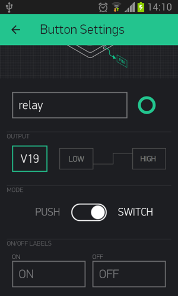
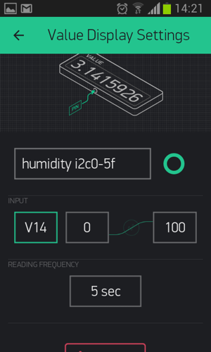
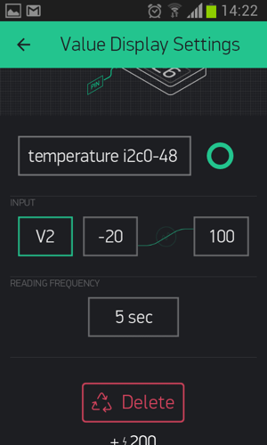
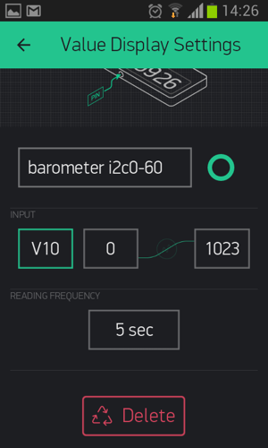

# Blynk - Mobile App Builder

<!-- toc -->

V tomto návodu si ukážeme, jak napojit BigClowní prvky na mobilní aplikaci Blynk.
Blynk ti umožní ovládat všechny funkce pohodlně ze smartphonu nebo tabletu pomocí grafických widgetů. Tlačítkem tak bůdeš schopen přepnout relé nebo rozsvítit LED pásek, sliderem měnit intenzitu a odstín světla, pomocí grafu zobrazit hodntoty teploty i dalších veličin.

   
   
## Jak funguje Blynk

Blynk není jen mobilní aplikace, ale také cloudová služba, která ti umožní ovládat nebo číst data ze senzorů v mobilu odkudkoliv s připojením na internet.
Stačí se přihlásit pod uživatelským účtem.
Stanice Bigclown si vyměňuje data se serverem i když není mobilní aplikace připojena.
V aplikaci tak lze např. zobrazit historii naměřené teploty z čidel za poslední týden nebo nastavit časový spínač na stanovenou hodinu.
Blynk nabízí ale i "offline" možnost, nainstalovat si server lokálně.
Sami jsme ale byli překvapení, jak rychlá je odezva při sepnutí relé i při připojení přes cloud.
Zpoždění je při bežném internetovém připojení takřka nepostřehnutelné.
(To DO obrázek)
## Instalace a založení účtu v programu Blynk

1. Nainstaluj Blynk na svoje zařízení (aplikace je dostupná na Google Play a App Store).
2. Spusť Blynk.
3. Vytvoř si uživatelský účet (Create New Account).

## Vytvoření Blynk projektu

4. Vytvoř nový projekt:

   

5. Zvol název projektu (Project Name) a jako HW Generic Board, způsob komunikace a stiskni *Create*.

   

## Přidávání widgetů v Blynku

Každý vložený prvek (widget) v Blynku “stojí” nějakou energii, po zaregistrování a přihlášení do aplikace je k dispozici zdarma 2000 bodů, což postačí na přidání většiny potřebných funkcí pro základní projekty.
Pokud budeš chtít vytvořit větší projekty s mnoha prvky a využít užitečné funkce jako graf historie pro sledování hodnot ze senzorů, doporučujeme dobít si další energii.
Výhodou je, že volná i zakoupená energie se po odstraněním prvku nebo celého projektu vrací a zároveň ji lze využít nezávisle na platformě (Android, IOS) souběžně na více zařízeních.
Stačí se jen přihlásit pod svým uživatelským účtem.
Pozor, za widgety, které přidáte na pracovní plochu telefonu se energie po jejich odstranění nevrací!

## Potřebné SW/HW vybavení
Za minimální konfiguraci lze považovat jednu stanici BigClown tvořenou Core Modulem popř dalšímy prvky, připojená k Raspberry Pi nebo jinému Lunuxovému počítači s nainstalovaným BigClonw SW.
Další stanice (Nody) již mohou být připojeny bezdrátově.
Podrobný postup zapojení prvků BigClown je popsán ve vzorovém projektu [Smart LED Strip](https://doc.bigclown.cz/smart-led-strip.html). Kompletní sadu lze také zakoupit ve [zvýhodněném setu](https://obchod.bigclown.cz/products/smart-led-strip-set).

1. Install Blynk on your smartphone / tablet.

   > **Note** Just use Google Play or App Store.

2. Run Blynk and select **Create new project**.

   

3. Give it a name (e.g. “bigclown demo”) and select **Generic Board** as a hardware.

   

4. Write down your Auth Token (or let the application to send it to you by e-mail).

   **TODO** Configure Blynk Auth token via MQTT.

5. Create an Menu element for LED.

   Set output as virtual pin V1 (see below for pin assignment).

   

6. Create selections “on”, “off”, “1 dot”, “2 dot”, and “3 dot” as menu items.

   

7. Create relay button on pin V19.

   

8. Create widgets for your sensors, i.e. humidity, temperature, lux-meter and barometer.

   
   
   
   

7. Now you have a working Blynk dashboard.

   

> **Tip** If you will contend with busy state of the virtual pin, then you should simply logout and login to Blynk app again.

## Virtual Pin Assignment for Blynk

| Virtual PIN  | Part of topic           | Payload key       | Unit                         |
| ------------ | ----------------------- | ----------------- | ---------------------------- |
| 1            | led/-                   | state             | on, off, 1-dot, 2-dot, 3-dot |
| 2            | thermometer/i2c0-48     | temperature       | °C                           |
| 3            | thermometer/i2c1-48     | temperature       | °C                           |
| 4            | thermometer/i2c0-49     | temperature       | °C                           |
| 5            | thermometer/i2c1-49     | temperature       | °C                           |
| 6            | lux-meter/i2c0-44       | illuminance       | lux                          |
| 7            | lux-meter/i2c1-44       | illuminance       | lux                          |
| 8            | lux-meter/i2c0-45       | illuminance       | lux                          |
| 9            | lux-meter/i2c1-45       | illuminance       | lux                          |
| 10           | barometer/i2c0-60       | pressure          | kPa                          |
| 11           | barometer/i2c0-60       | altitude          | m                            |
| 12           | barometer/i2c1-60       | pressure          | kPa                          |
| 13           | barometer/i2c1-60       | altitude          | m                            |
| 14           | humidity-sensor/i2c0-5f | relative-humidity | %                            |
| 15           | --                      | --                | --                           |
| 16           | humidity-sensor/i2c1-5f | relative-humidity | %                            |
| 17           | --                      | --                | --                           |
| 18           | co2-sensor/i2c0-38      | concentration     | ppm                          |
| 19           | relay/i2c0-3b           | state             | true, false                  |
| 20           | relay/i2c0-3f           | state             | true, false                  |
