# Blynk - Ovládej BigClowna z mobilu

<!-- toc -->

V tomto návodu si ukážeme, jak napojit BigClowní prvky na mobilní aplikaci Blynk.
Blynk ti umožní ovládat všechny funkce pohodlně ze smartphonu nebo tabletu pomocí grafických widgetů. Tlačítkem tak bůdeš schopen přepnout relé nebo rozsvítit LED pásek, sliderem měnit intenzitu a odstín světla, pomocí grafu zobrazit průběh teploty i dalších veličin.

   
   
## Jak funguje Blynk

Blynk není jen mobilní aplikace, ale také IoT cloud server, který ti umožní ovládat nebo číst data ze senzorů v mobilu odkudkoliv s připojením k internetu.
Stačí se přihlásit pod uživatelským účtem.
Stanice Bigclown si vyměňuje data se serverem i když není mobilní aplikace připojena.
V aplikaci tak lze např. zobrazit historii naměřené teploty za poslední týden nebo nastavit časový spínač na stanovenou hodinu.
Blynk nabízí ale i "off-line" možnost, nainstalovat si server lokálně.
Sami jsme ale byli překvapení, jak rychlá je odezva při sepnutí relé i při připojení přes vzdálený server.
Zpoždění je při bežném internetovém připojení takřka nepostřehnutelné!
Více o Blynku lze nalézt v [oficiální dokumentaci](http://docs.blynk.cc/).

   

## Potřebné SW/HW vybavení
* telefon / tablet s OS Android 4.0.3 a vyšší nebo iOS 8.0 a vyšší
* minimálně jednu pevnou stanici BigClown tvořenou Core Modulem popř dalšími prvky, připojenou k Raspberry Pi nebo jinému Lunuxovému počítači s nainstalovaným SW balíčkem BigClown Hub a připojením k internetu
* samozřejmě lze napojit i další bezdrátové stanice (Nody)

Podrobný postup zapojení prvků BigClown je popsán ve vzorovém projektu [Smart LED Strip](https://doc.bigclown.cz/smart-led-strip.html).
Kompletní sadu lze také zakoupit ve [zvýhodněném setu](https://obchod.bigclown.cz/products/smart-led-strip-set).
Tento návod doplňuje vzorový projekt Smart LED strip, slouží také ale jako obecný návod pro všechny ostatní BigClowní projekty s Blynkem.

## Instalace a založení účtu v programu Blynk

1. Nainstaluj Blynk na svoje zařízení (aplikace je dostupná na Google Play a App Store).
2. Spusť Blynk.
3. Vytvoř si uživatelský účet (Create New Account).

## Vytvoření Blynk projektu

4. Vytvoř nový projekt:

   

5. Zvol název projektu (Project Name) a jako HW Generic Board. 
Vyber způsob komunikace a stiskni *Create*.

   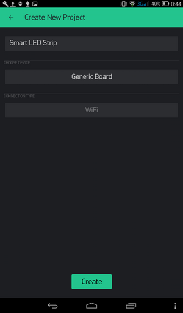

## Přidávání widgetů v Blynku

Každý vložený prvek (widget) v Blynku “stojí” nějakou energii, po zaregistrování a přihlášení do aplikace je k dispozici zdarma 2000 bodů, což postačí pro přidání většiny potřebných funkcí pro základní projekty s prvky typu tlačítko nebo slidery.
Pokud budeš chtít vytvořit větší projekty s mnoha prvky a využít užitečné funkce jako graf historie pro sledování hodnot ze senzorů, doporučujeme dobít si další energii.
Výhodou je, že volná i zakoupená energie se po odstraněním prvku nebo celého projektu vrací a zároveň ji lze využít nezávisle na platformě (Android, IOS) souběžně na více zařízeních.
Stačí se jen přihlásit pod svým uživatelským účtem.
**Pozor**, za widgety, které přidáte na pracovní plochu telefonu se energie po jejich odstranění již nevrací!

   

## Tlačítko

   

Widget Button se hodí pro ovládání relé spínání LED pásku nebo aktivaci různých funkcí.
Tlačítko přidej dotykem na prázdnou plochu v Blynk projektu (popř. ikonou *+Add*). 
Do nastavení tlačítka vstoupíš dotykem na něj. 
Lze nastavit, popis, mapování výstupu (viz níže), stavové hodnoty (typicky 0 / 1), dále logiku (PUSH generuje pouze pulz, SWITCH trvale drží stav).
Lze si také navolit barvu tlačítka a popisky pro stavy *ON* / *OFF*

   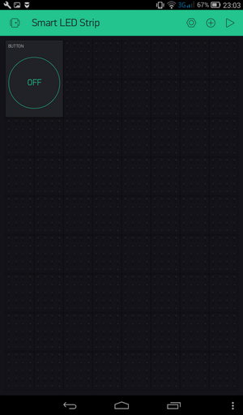
   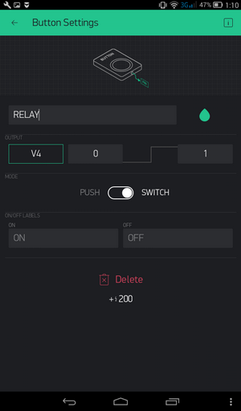   

## Napojení widgetu na prvky BigClown

   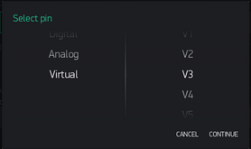

Na tlačítku si ukážeme propojení widgetu se systémem BigClown.
Spojení mezi Blynkem jednotlivými prvky obstárává blynk-plugin který je součástí linuxových komponent nazvaných BigClown Hub.
Výstup (OUTPUT) lze namapovat na tzv. *Virtual pin* *V0* až *V99*. 
ve výchozím stavu jsou nastaveny Virtuální Piny následovně:

### Výchozí mapování Virtul Pinů v blynk-pluginu:

| Virtual PIN | Popis                                        | Rozsah         | Jednotka |
|:-----------:| -------------------------------------------- |:--------------:|:--------:|
| 0           | senzor teploty                               | -40 až 125     | °C       |
| 1           | senzor relativní vlhkosti                    | 0 až 100       | %        |
| 2           | intenzita světla LED pásku                   | 0 až 1023*     |          |
| 3           | zapnutí / vypnutí LED pásku                  | 1 / 0          |          |
| 4           | zapnutí / vypnutí relé                       | 1 / 0          |          |
| 5           | zeRGBa, volba barvy                          | 0 až 1023*     |          |
| 6           | Widget Menu: nastavení režimu LED pásku (1)  | 1, 2, 3, 4     |          |
| 7           | ovládání bílé složky LED pásku               | color          |          |
| 8-20        | uživatelské předvolby pro tlačítka (2)       | color          |          |

(1) 1 = rules, 2 = color, 3 = compound, 4 = framebuffer)

(2) Přiřazené funkce se konfigurují pomocí souboru *etc/bigclown/plugin/led-strip.user*

## Spárování Blynk projektu s BigClownem

Pro jednoznačnou identifikaci Blynk projektu slouží tzv. autorizační token.
Pro navázání komunikace mezi Blynk projektem a Raspberry Pi, kde běží BigClown Hub, je nutné token nastavit:

1. Vstup do nastavení projektu:

   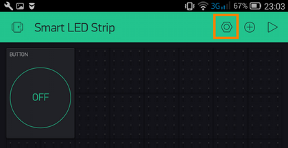

2. Nech si poslat autorizační token na email.
   *Tip*: Budou-li se zasláním emailu potíže, zkopírujte token do schránky (ikona “Copy all”) a následně si jej pošli např. emailem ručně:

   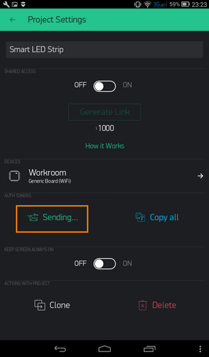

3. Připoj se k Raspberry Pi a nastav autorizační token pomocí MQTT příkazu:
   ...   
   mosquitto_pub -t "plugin/blynk/config/set" -m '{"token":"your_token"}' -r
   ...
   
   **Pozor** závorky uvozující autorizační token jsou součástí příkazu:

  

  Poznámka: parametr -r (remain) v MQTT zaručí, že se nastavení uchová i po restartu Raspberry P

4. Spusť projekt a vyzkoušej funkci tlačítka!

  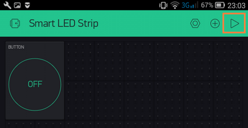

5. Pro přidání dalších prvků zastav běžící Blynk projekt.

  

### První pomoc
Pokud se po spuštění projektu Blynk vypíše hlášku “Device is offline” zkontroluj:
* připojení k internetu svého telefonu nebo tabletu
* připojení Raspberry Pi k internetu
* zda jsi zadal správný autorizační token

## Slider a Step

  
  

Pro regulaci hodnoty ve vetším rozsahu (např. změna intenzity světla), lze vyžít widget *Slider* nebo alternativně *Step H/V* pro změnu hodnot pomocí tlačítek +/-.

  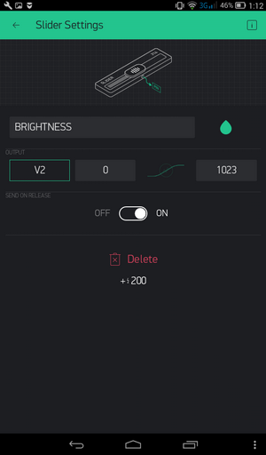    

 
## zeRGBa - ovládání RGB složek

  

Widget zeRGBa je ideální pro ovládání RGB složek vícebarevných LED pásků.
Pro napojení na adressovatelný RGB pásek zvol v nastavení volbu MERGE a namapuj jej na Virtual PIN 5.
Doporučjeme vypnout volbu *SEND ON RELEASE* (poté je změna barev obnovována průběžně při pohybu po ploše zebry). 

Poznámka: Rozsahy hodnot pro ovládání LED pásku jsou zvoleny na výchozích 0 až 1023 (blynk-pluginu tyto hodnoty přepočítá na 00 až ff hexa).
 
  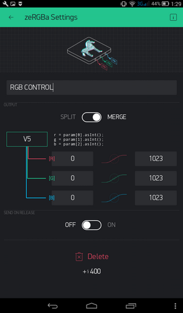

## Menu
  
Prvek Menu může sloužit pro výběr předvoleb. 
Ve vzorovém projektu [Smart LED Strip](https://doc.bigclown.cz/smart-led-strip.html) je menu použito pro výběr režimů LED pásku.

  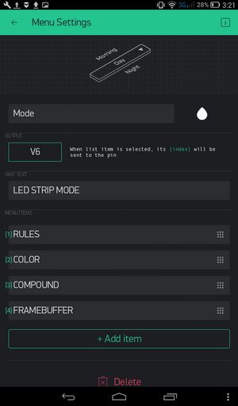

## Value Display a Labeled Value - četní hodnot

  

Oba prvky ti umožňí sledovat aktuální hodnoty ze senzorů. U widgetu Labeled Value (stojí více energie) si lze navíc přidat i jednotku, která se zobrazuje za hodnotou.
Nastavit lze název, barvu widgetu, rozsah hodnot a frekvenci čtení. 
Pokud ji nastavíš na *PUSH*, hodnoty se budou obnovovat automaticky při obdržené dat z jednotek.

  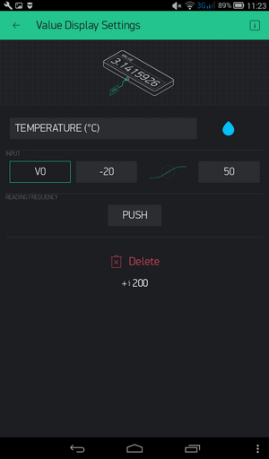

## History Graph - průběhy veličin
Widget History Graph ti umožní sledovat průběhy měřených veličin. V jednom grafu můžeš zobrazit až čtyři různé veličiny. Nastavit lze automatický nebo uživatelský rozsah v ose y, zobrazení legendy a časovou osu. 

   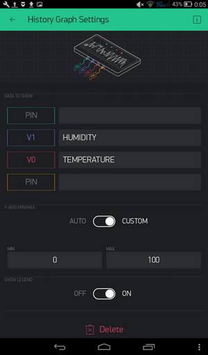

**Tip** Pro zvětšení plochy grafu stopni projekt, stiskni a drž plochu widgetu a poté ho pohybem roztáhni. Zvětšování plochy widgetů je zatím funkční pouze ve verzi pro Android.

## Tab - rozdělení projektu na více záložek
Pokud se ti všechny prvky nevejdou na jednu plochu, lze ji rozšířit pomocí widgetu *Tab*.

   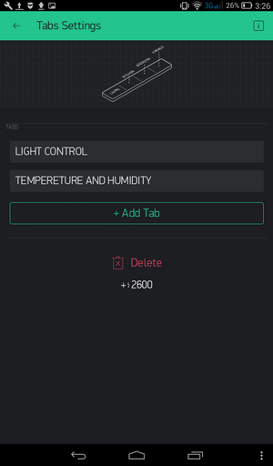

## Rychlé naklonování projektu

to do