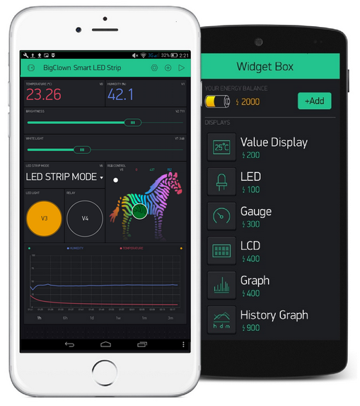
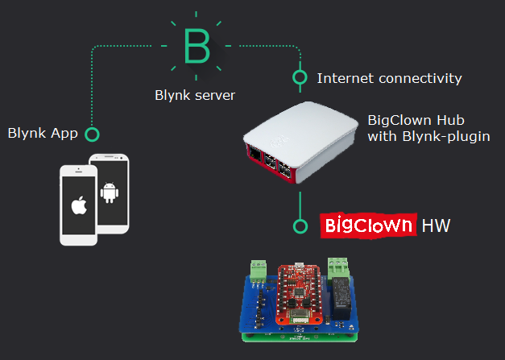
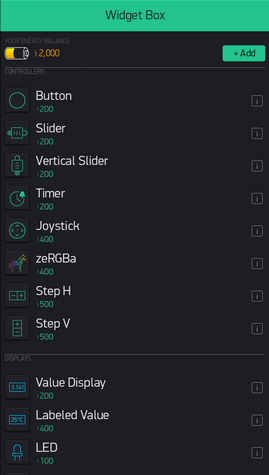
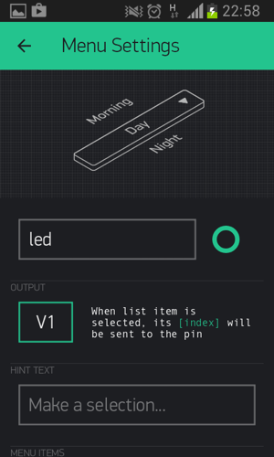
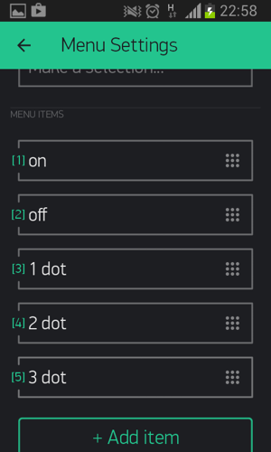
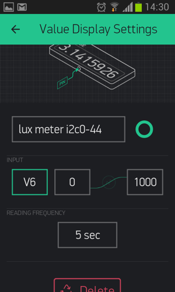
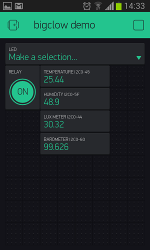

# Blynk - Ovládej BigClowna z mobilu

<!-- toc -->

V tomto návodu si ukážeme, jak napojit BigClowní prvky na mobilní aplikaci Blynk.
Blynk ti umožní ovládat všechny funkce pohodlně ze smartphonu nebo tabletu pomocí grafických widgetů. Tlačítkem tak bůdeš schopen přepnout relé nebo rozsvítit LED pásek, sliderem měnit intenzitu a odstín světla, pomocí grafu zobrazit hodntoty teploty i dalších veličin.

   
   
## Jak funguje Blynk

Blynk není jen mobilní aplikace, ale také IoT cloud server, která ti umožní ovládat nebo číst data ze senzorů v mobilu odkudkoliv s připojením k internetu.
Stačí se přihlásit pod uživatelským účtem.
Stanice Bigclown si vyměňuje data se serverem i když není mobilní aplikace připojena.
V aplikaci tak lze např. zobrazit historii naměřené teploty za poslední týden nebo nastavit časový spínač na stanovenou hodinu.
Blynk nabízí ale i "offline" možnost, nainstalovat si server lokálně.
Sami jsme ale byli překvapení, jak rychlá je odezva při sepnutí relé i při připojení přes vzdálený server.
Zpoždění je při bežném internetovém připojení takřka nepostřehnutelné.
Více o Blynku lze nalézt v [dokumentaci](http://docs.blynk.cc/).

   

## Potřebné SW/HW vybavení
* chytrý telefon s OS Android 4.0.3 a vyšší nebo iOS 8.0 a vyšší
* minimálně jednu stanici BigClown tvořenou Core Modulem popř dalšími prvky, připojenou k Raspberry Pi nebo jinému Lunuxovému počítači s nainstalovaným SW BigClown Hub.
* další bezdrátové prvky (Nody) již jsou již pouze volitelné.

Podrobný postup zapojení prvků BigClown je popsán ve vzorovém projektu [Smart LED Strip](https://doc.bigclown.cz/smart-led-strip.html).
Kompletní sadu lze také zakoupit ve [zvýhodněném setu](https://obchod.bigclown.cz/products/smart-led-strip-set).
Tento návod tedy doplňuje vzorový projekt Smart LED strip, slouží ale také jako obecný návod pro všechny ostatní projekty s Blynkem.

## Instalace a založení účtu v programu Blynk

1. Nainstaluj Blynk na svoje zařízení (aplikace je dostupná na Google Play a App Store).
2. Spusť Blynk.
3. Vytvoř si uživatelský účet (Create New Account).

## Vytvoření Blynk projektu

4. Vytvoř nový projekt:

   

5. Zvol název projektu (Project Name) a jako HW Generic Board, způsob komunikace a stiskni *Create*.

   

6. Spárování projektu se BigClown Hubem
Každý projekt v Blynk je indetifikován tzv. 

## Přidávání widgetů v Blynku

Každý vložený prvek (widget) v Blynku “stojí” nějakou energii, po zaregistrování a přihlášení do aplikace je k dispozici zdarma 2000 bodů, což postačí na přidání většiny potřebných funkcí pro základní projekty s prvky typu tlačítko nebo slidery.
Pokud budeš chtít vytvořit větší projekty s mnoha prvky a využít užitečné funkce jako graf historie pro sledování hodnot ze senzorů, doporučujeme dobít si další energii.
Výhodou je, že volná i zakoupená energie se po odstraněním prvku nebo celého projektu vrací a zároveň ji lze využít nezávisle na platformě (Android, IOS) souběžně na více zařízeních.
Stačí se jen přihlásit pod svým uživatelským účtem.
Pozor, za widgety, které přidáte na pracovní plochu telefonu se energie po jejich odstranění nevrací!

   

## Tlačítka
Widget Button se hodí pro ovládání relé spínání LED pásku nebo aktivaci různých funkcí.
Tlačítko přidej dotykem na prázdnou plochu v Blynk projektu (popř. ikonou *+Add*). 
nastavení tlačítka nebo jiného libovolného widgetu vstoupíš dotykem na něj. 
Lze nastavit, popis, mapování výstupu (viz níže), logické hodnoty (typicky 0 / 1), dále logiku (PUSH generuje pouze pulz, SWITCH trvale drží stav).
Lze také zmenit barvu tlačítka a popisky pro stavy *ON* / *OFF*

## Nampování widgetu na funkce prvky BigClown
Na tlačítku si ukážeme propojení widgetu s moduly BigClown
Spojení mezi Blynkem jednotlivými prvky obstárává blynk-plugin běžící na spolu s dalším SW Raspberry Pi.
Ve výchozím stavu jsou nastaveny Virtual Piny následovně:

Výstup (OUTPUT) lze namapovat na tzv. *Virtual pin* *V0* až *V99*. virtuálních pinů), 

1. Install Blynk on your smartphone / tablet.

   > **Note** Just use Google Play or App Store.

2. Run Blynk and select **Create new project**.

   

3. Give it a name (e.g. “bigclown demo”) and select **Generic Board** as a hardware.

   

4. Write down your Auth Token (or let the application to send it to you by e-mail).

   **TODO** Configure Blynk Auth token via MQTT.

5. Create an Menu element for LED.

   Set output as virtual pin V1 (see below for pin assignment).

   

6. Create selections “on”, “off”, “1 dot”, “2 dot”, and “3 dot” as menu items.

   

7. Create relay button on pin V19.

   

8. Create widgets for your sensors, i.e. humidity, temperature, lux-meter and barometer.

   
   
   
   

7. Now you have a working Blynk dashboard.

   

> **Tip** If you will contend with busy state of the virtual pin, then you should simply logout and login to Blynk app again.

## Výchozí namapování Virtul PINů Blynku s BigClown Blynk-pluginem:

| Virtual PIN | Popis                                        | Rozsah         | Jednotka |
| ----------- | -------------------------------------------- | -------------- | -------- |
| 0           | senzor teploty                               | -40 až 125     | °C       |
| 1           | senzor relativní vlhkosti                    | 0 až 100       | %        |
| 2           | intenzita světla LED pásku                   | 0 až 1023*     |          |
| 3           | zapnutí / vypnutí LED pásku                  | 1 / 0          |          |
| 4           | zapnutí / vypnutí relé                       | 1 / 0          |          |
| 5           | zeRGBa, volba barvy                          | 0 až 1023*     |          |
| 6           | menu, nastavení režimu (rules, color, compound, framebuffer)            | 1, 2, 3, 4     |          |
| 7           | ovládání bílé složky LED pásku               | color          |          |
| 8-20        | uživatelské předvolby pro tlačítka           | color          |          |
   
