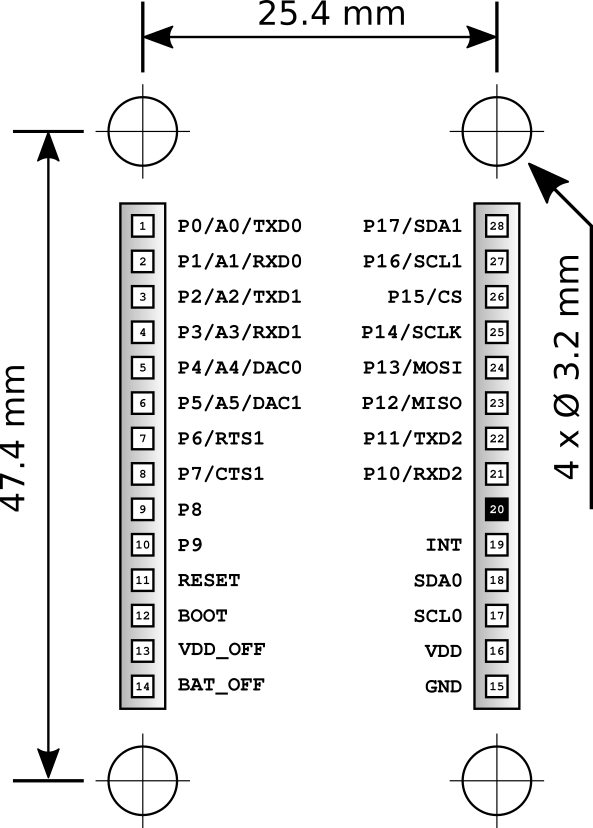
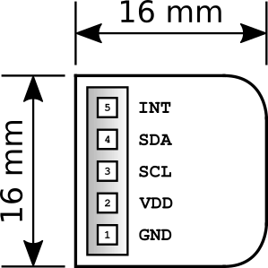

# Headers & Signals

In BigClown we emphasize hardware modularity and re-usability.
To achieve such goal we had to come up with proper interconnect system between our components.
We decided to stick with well-known and widely accepted standard - **headers** with 2.54 mm (0.1 inch) pitch.

Our header system consists of two types of components - **pins** and **sockets**.

In order to maintain compatibility between various hardware components we came up with our own two standards for electro-mechanical format - **module** and **tag**.

## Module Format

Format **Module** defines:

* Spacing and signals between two rows of 14-pin **headers**.
* Four mounting hole positions and their diameter.
* Position of mechanical key (filled hole in header) preventing reverse insertion.
* Position of **sockets** from top view.
* Position of **pins** from the bottom view.
* Recommended PCB height is 55 mm.
* Recommended PCB thickness 1.5 mm.
* Radius of rounded corners 3.8 mm.

### Drawing

### Signals

This is a summary of basic peripherals available on **module** header:

* 18x **GPIO** channels (General Purpose Input/Output)
* 5x **ADC** channels (Analog-to-Digital Converter)
* 2x **DAC** channels (Digital-to-Analog Converter)
* 3x **UART** channels (Universal Asynchronous Receiver Transmitter)
* 2x **I²C** bus (Inter-Integrated Circuit)
* 1x **SPI** bus (Serial Peripheral Interface)

The following table defines signal assignment on **module** header:

|     | Signal   | Description                       |
| --- | :------- | :-------------------------------- |
| 1   | P0       | GPIO channel 0                    |
|     | A0       | ADC channel 0                     |
|     | TXD0     | UART channel 0 - TXD signal       |
| 2   | P1       | GPIO channel 1                    |
|     | A1       | ADC channel 1                     |
|     | RXD0     | UART channel 0 - RXD signal       |
| 3   | P2       | GPIO channel 2                    |
|     | A2       | ADC channel 2                     |
|     | TXD1     | UART channel 1 - TXD signal       |
| 4   | P3       | GPIO channel 3                    |
|     | A3       | ADC channel 3                     |
|     | RXD1     | UART channel 1 - RXD signal       |
| 5   | P4       | GPIO channel 4                    |
|     | A4       | ADC channel 4                     |
|     | DAC0     | DAC channel 0                     |
| 6   | P5       | GPIO channel 5                    |
|     | A5       | ADC channel 5                     |
|     | DAC1     | DAC channel 1                     |
| 7   | P6       | GPIO channel 6                    |
|     | RTS1     | UART channel 1 - RTS signal       |
| 8   | P7       | GPIO channel 7                    |
|     | CTS1     | UART channel 1 - CTS signal       |
| 9   | P8       | GPIO channel 8                    |
| 10  | P9       | GPIO channel 9                    |
| 11  | RESET    | System reset                      |
|     |          | _Also button "R" on Core Module_  |
| 12  | BOOT     | Boot mode                         |
|     |          | _Also button "B" on Core Module_  |
| 13  | VDD_OFF  | From top side: VDD_OFF output     |
|     |          | From bottom side: VDD_OFF input   |
| 14  | BAT_OFF  | Battery disconnect signal         |
| 15  | GND      | System GND (ground)               |
| 16  | VDD      | System VDD (positive rail)        |
| 17  | SCL0     | I²C bus 0 - SCL signal            |
| 18  | SDA0     | I²C bus 0 - SDA signal            |
| 19  | INT      | System interrupt signal           |
| 20  |          | System interrupt signal           |
| 21  | P10/RXD2 | UART channel 2 - RXD signal       |
| 22  | P11/TXD2 | UART channel 2 - TXD signal       |
| 23  | P12/MISO | SPI bus - MISO signal             |
| 24  | P13/MOSI | SPI bus - MOSI signal             |
| 25  | P14/SCLK | SPI bus - SCLK signal             |
| 26  | P15/CS   | SPI bus - CS signal               |
| 27  | P16/SCL1 | I²C bus 1 - SCL signal            |
| 28  | P17/SDA1 | I²C bus 1 - SDA signal            |

## Tag Format

The primary purpose of **tag** format is to provide signal break-out for I²C peripheral in a compact form-factor.
It can be anything I²C-related - e.g. sensors, memories, RTCs, etc.

Format **tag** defines:

* Signals on a 5-pin **header**.
* Letter "D"-shaped PCB outline.
* Mechanical dimensions 16 x 16 mm.
* Recommended PCB thickness 1.5 mm.
* Radius of rounded corners is 3.8 mm.

### Drawing

### Signals

The following table defines signal assignment on **tag** header:

|     | Signal | Description                |
| --- | :----- | :------------------------- |
| 1   | GND    | System GND (ground)        |
| 2   | VDD    | System VDD (positive rail) |
| 3   | SCL    | I²C bus - SCL signal       |
| 4   | SDA    | I²C bus - SDA signal       |
| 5   | INT    | System interrupt signal    |
