# Projekt "Smart LED Strip"

<!-- toc -->


## O čem projekt je a co ti přinese

Jde o jednoduchý projekt, jehož cílem je ukázat snadnost budování domácí automatizace s našim řešením.
Výsledkem projektu je "chytrý LED pásek " umístěný na viditelném místě v obývacím pokoji, který si můžeš vzdáleně ovládat z telefonu nebo tabletu.


LED pásek je složený ze 144 adresovatených RGBW čipů, a díky výkonu 15W jej lze použít i pro komfortní osvětlení.
Ve výchozím nastavením je pomocí pásku indikováno překročení nastavených limitů teploty a vlhkosti změnou barvy.
V návodu si ukážeme, jak lze limity změnit nebo nastavit vlastní pravidla a idikovat změnou barvy např. pouze část pásku.
Sestava dále umožňuje dálkově spínat externí spotřebič pomocí relé.
Ovládání a čtení hodnot si ukážeme pomocí MQTT příkazů, ale hlavně pomocí  mobilní aplikace Blynk.


Základem projektu jsou dvě jednotky:


### Base jednotka

Tato jednotka je zodpovědná za řízení LED pásku a bezdrátový příjem dat z Remote jednotky.
Přijatá dat jsou z Base jednotky přenášena do Raspberry Pi, kde se vyhodnotí a dle definovaných pravidel se nastaví požadované barvy LED pásku.
Jednotku Base lze použít samostatně nezávisle na Remote, např. pouze pro ovládání světla a silového relé.


### Remote jednotka

Jednotka Remote je napájena z baterií a s Base komunikuje bezdrátově ve frekvenčním pásmu 868 MHz. Remote se stará o měření hodnot teploty a vlhkosti, které jsou každých 30 s vysílány a přijímány jednotkou Base. Tlačítko boot na Core modulu lze použít pro dálkové ovládání (zapínání / vypínání LED pásku).


Celý koncept popisuje následující diagram:

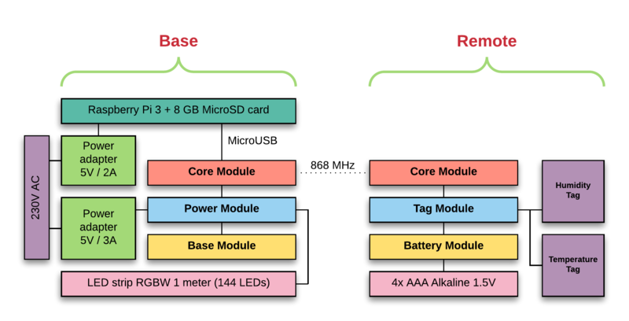


## Co všechno k projektu potřebuješ 

Všechny potřebné výrobky jsme zabalili do [cenově zvýhodněné sady](https://obchod.bigclown.cz/products/smart-led-strip-set), kterou si můžeš koupit v našem obchodě.
Pokud si již vlastníš Core modul nebo si ho koupíš samostatně, pak si je musíš flashnout správným firmware, a [to podle tohoto návodu](core-module.md).

Sada obsahuje:

Base unit
* 1x Base Module
* 1x Power Module
* 1x Core Module s Base unit firmwarem

Remote unit
* 1x Battery Module
* 1x Core Module s Remote unit firmwarem
* 1x Tag Module
* 1x Temperature Tag
* 1x Humidity Tag
* 1× LED pásek RGBW (1m / 144 LED)
* 1x Raspberry Pi 3
* 1x 8 GB MicroSD karta s předinstalovaným systémem
* 1x Krabička pro Raspberry Pi 3
* 1x USB 2.0 kabel A/Micro-B
* 1x Napájecí adaptér 5V/2A pro Raspberry Pi 3
* 1x Napájecí adaptér 5V/3A pro Power Modul


Dále budeš potřebovat:

* PC nebo notebook s Windows, MacOS nebo Linux
* Ethernet kabel
* LAN router/switch s jedním volným portem
* Připojení k internetu


## Postup instalace sestavy

1. *Sestav si Remote jednotku*

   

2. *Sestav si Base jednotku*

   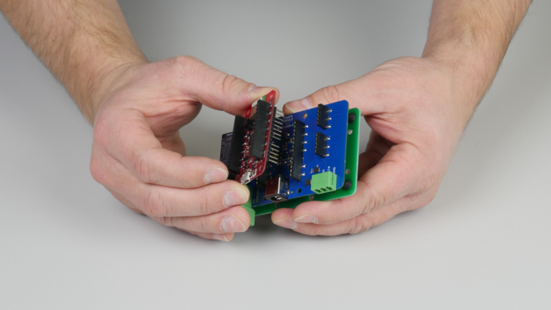

3. *Připoj LED pásek k Base jednotce*

   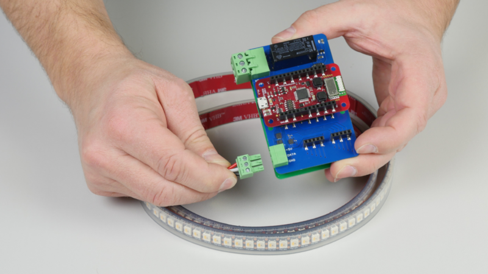

4. *Připoj MicroUSB kabelem Base jednotku k Raspberry Pi*

   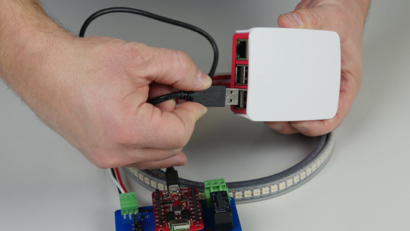

5. *Připoj Ethernet kabel k Raspberry Pi*

   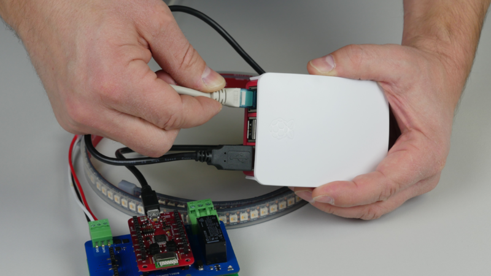

6. *Připoj napájecí adaptér k Base jednotce*

   

7. *Připoj napájecí adaptér k Raspberry Pi*

   

8. *Vlož baterie do Remote jednotky*

   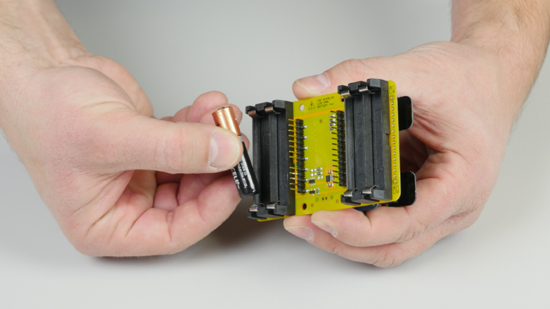

9. *Aktivuj párovací mód na Base jednotce*

   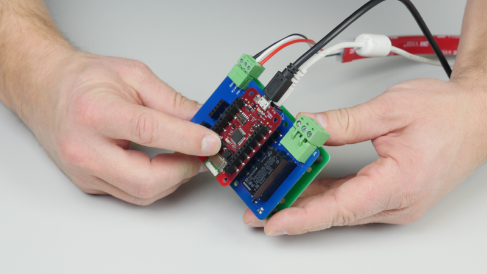

   Zmáčkni a drž tlačítko BOOT (označeno písmenem *B*) na Core modulu Base jednotky dokud červená LED na Core Modulu nezačne blikat.
   Párovací mód na Base jednotce je aktivní dokud nepřijme párovací signál z      Remote jednotky.

   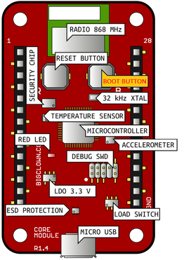

10. *Vyšli párovací signál z remote jednotky*

    Zmáčkni a drž tlačítko BOOT na Core modulu Remote jednotky, dokud nedojde k 2s rozsvícení a zhasnutí LED, čímž bylo indikováno odeslání párovacího signálu.
    BOOT tlačítko na Core modulu je označeno písmenem "B".
    Nyní došlo k odeslání párovacího signálu a LED na Base jednotce by měla přestat blikat.

    

11. *Zapni světlo na LED pásku*

    Pro rozsvícení LED pásku krátce stiskni tlačítko BOOT na jednotce Base nebo Remote.
    Zhasnutí světla lze provézt opětovným stiskem tlačítka BOOT.
    Nyní se systém nachází v tzv. režimu “rules”, kdy reaguje na překročení přednastavených hodnot teploty a vlhkosti změnou barvy **(podrobněji zde) [vložit přímý link].**

    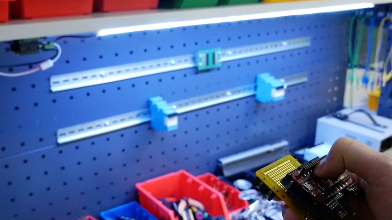


## Rychlý test a oživení pomocí MQTT zpráv

Všechny zprávy mezi Linuxovými komponentami systému jsou vyměňovány pomocí tzv. MQTT brokeru.
MQTT broker tvoří jádro systému domácí automatizace BigClown.
Více podrobností o technologii MQTT nalezneš zde:

* [MQTT - Messaging via Broker](mqtt.md)

* [Mosquitto - MQTT Broker](mosquitto.md)

### Připojení k Raspberry Pi

Pro ověření funkce systému a komunikaci s MQTT brokerem se připoj k Raspberry Pi pomocí protokolu SSH:

1.  Zjisti IP adresu svého Raspberry Pi (prozkoumej menu routeru nebo použi         program typu [Advanced IP scanner (Windows)],                            (http://www.advanced-ip-scanner.com/)), [IP Scaner for (Mac)]    (https://itunes.apple.com/us/app/ip-scanner/id404167149?mt=12).

2.  Připoj se k Raspberry Pi pomocí protokolu SSH (port 22):
    
    **Ve Windows:**

    Použij program [PuTTY](http://www.putty.org), jako “Host name” zvol pi@192.168.0.120 (upravte na IP adresu vašeho Raspberry Pi).
    V poli “Saved Sessions” si můžeš konfiguraci uložit pro opakované použití stiskem “Save”.
    Připojení zahájíš stiskem tlačítka “Open”.

    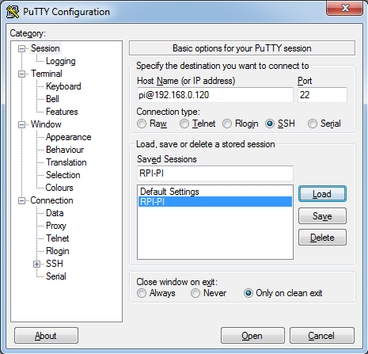
    

   **V Linuxu a MacOS:**

    Použij Terminál a příkaz ssh pi@192.168.0.120 (IP adresu uprav na tvé Raspberry Pi).
    Při prvním připojení k Raspberry Pi tě systém vyzve k potvrzení autorizačního klíče, zadejte “yes” a pokračujt.

3.  Pokud se připojení zdařilo, systém tě vyzve k zadání hesla.
    Výchozí heslo je "raspberry". Po úspěšném zadání hesla bys měl vidět odpověď podobnou příkladu:

   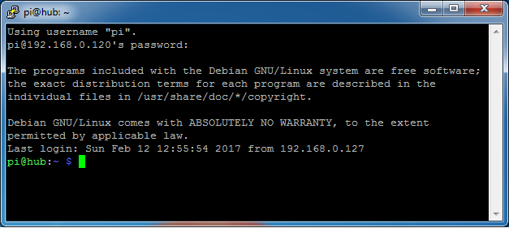    

4.  Než se pustíš do testování a následujících kroků je nutné aktualizovat SW       balíčky v Raspberry Pi:

    ```
    sudo apt-get update && sudo apt-get upgrade
    ```

### Otestování funkcí a hrátky s MQTT
Zde si popíšeme, jak rychle otestovat hlavní funkce systému pomocí příkazů MQTT,podrobněji budou všechny funkce popsány později v dalších návodech.
Pokud si chceš rovnou rozjet ovládání pomocí mobilní aplikace Blynk doporučujeme otestovat alespoň několik prvních příkazů a poté přeskoč na kapitolu 4 **[vložit link].**


**Ovládání LED pásku:**


1.  Zapni světlo (LED pásek):

    ```
    mosquitto_pub -t "nodes/base/light/-/set" -m '{"state": true}'
    ```

2.  Nastavení červené barvy:

    ```
    mosquitto_pub -t "plugin/led-strip/color/set" -m \"#ff0000\"
    ```

3.  Zvol nižší intenzitu světla, na 30% (platný rozsah 0 až 100%):

    ```
    mosquitto_pub -t "plugin/led-strip/brightness/set" -m 30
    ```

4.  Nastav zelenou barvu:
    
    ```
    mosquitto_pub -t "plugin/led-strip/color/set" -m \"#00ff00\"
    ```

5.  Nastav bílé světlo:
    
    ```
    mosquitto_pub -t "plugin/led-strip/color/set" -m '"#000000(ff)"'
    ```

6.  Vytvoř *studenou bílou* namícháním bílé s modorou:
    
    ```
    mosquitto_pub -t "plugin/led-strip/color/set" -m '"#000099(ff)"'
    ```

7.  Rozsvícení pouze druhé poloviny pásku bílou pomocí funkce compound:

    ```
    mosquitto_pub -t "plugin/led-strip/compound/set" -m '[72, "#000000", 72, "#000000(ff)"]'
    ```
       
8.  Rozdělení na třetiny: červená, zelená, modrá

    ```
    mosquitto_pub -t "plugin/led-strip/compound/set" -m '[48, "#ff0000", 48, "#00ff00", 48, "#0000ff"]'
    ```

9.  Vytvoření efektu duhy:

    ```
    mosquitto_pub -t "plugin/led-strip/compound/set" -m '[20, "#ff0000", 20, "#ff7f00", 20, "#ffff00", 20, "#00ff00", 20, "#0000ff", 20, "#960082", 21, "#D500ff"]'
    ```
      
10. Vypni LED pásek:

    ```
    mosquitto_pub -t "nodes/base/light/-/set" -m '{"state": false}'
    ```

**Poznámka:** 
Hodnoty barev se zadávají v hex formátu v rozsahu “00” až “ff”.
Bílá složka je při zadávání nepovinná a zadává se v závorkách za RGB složky.
Je možné míchat všechny barevné komponenty (RGB) včetně bílé složky (W).
Pokud je hodnota bílé složky nulová, hodnotu v závorce lze vynechat.
Např. pro rozsvícení pouze červené barvy lze použít:

    
*mosquitto_pub -t "plugin/led-strip/color/set" -m '"#ff0000(00)"'*
    

nebo jednodušeji:


*mosquitto_pub -t "plugin/led-strip/color/set" -m \"#ff0000\"*


**Varování:**
Při nastavení maximální svítivosti (brightness = 100 %) nedoporučujeme rozsvěcet na plný výkon více než dvě barevné složky (nebo bílou složku + barvu).
Pokud nastavíte všechny čtyři složky (RGBW) na maximální hodnotu (ff) přetížíte napájecí adaptér.
Pro 100% výkon doporučujeme použít silnější napájecí adaptér min. 5V/5A a dále instalaci LED pásku do hliníkové lišty nebo její přilepení na kovový povrch pro lepší odvod tepla!


**Ovládání Relé**
Zapni relé (sepnutí kontaktu “NO” s “C”):


    ```
    mosquitto_pub -t "nodes/base/relay/-/set" -m '{"state": true}'
    ```


Vypni relé (sepnutí kontaktu “NC” s “C”):


    ```
    mosquitto_pub -t "nodes/base/relay/-/set" -m '{"state": false}'
    ```


**První pomoc:**
Pokud jsi se úspěšně připojili k Raspberry Pi a LED pásek nebo relé nejde zapnout, zkontroluj, zda jsi připojili 5V DC adaptér do Power Modulu na Base jednotce (rozsvícený pásek je indikován také červenou LED na Core Modulu stanice Base).

**Čtení hodnot ze senzorů na Remote unit**
Čtení hodnot teploty a vlhkosti ze senzorů připojených na Remote unit (odesílaných každých 30 s):

    ```
    mosquitto_sub -v -t "nodes/remote/#"
    ```

do 30 s bys měl obdržet zprávu s výpisem teploty a vlhkosti:
*nodes/remote/thermometer/i2c0-49 {"temperature": [20.31, "\u2103"]}
nodes/remote/humidity-sensor/i2c0-40 {"relative-humidity": [40.6, "%"]}*

Pro ukončení monitorováni stiskněte *Ctrl-C*

**Použití LED pásku pro indikaci hodnot teploty a vlhkosti:**
Pro indikaci nastavených hodnot je nutné opětovně zapnout LED pásek a přepnout ho do režimu “rules”:
    
    ```
    mosquitto_pub -t "nodes/base/light/-/set" -m '{"state": true}'
    ```

    ```
    mosquitto_pub -t "plugin/led-strip/mode/set" -m \"rules\"
    ```

V režimu rules je ve výchozím stavu nastavena následující logika:
Pokud se pohybují hodnoty teploty a vlhkosti v nastavených mezích svítí LED pásek bíle, překročení stanovených mezí je indikováno změnou barvy, přičemž prioritu má indikace vlhkosti:

*   Zelená: relativní vlhkost je příliš vysoká (> 60%)
*   Žlutá: relativní vlhkost příliš nízká (< 30%)
*   Červená: teplota je příliš vysoká (> 26°C)
*   Modrá: teplota je příliš nízká (< 22°C)
*   Bílá: hodnoty teploty i vlhkosti v nastavených mezích

Meze hodnot i vlastní funkci lze libovolně upravovat editací příkazu: 
    
    ```
    mosquitto_pub -t "plugin/led-strip/rules/set" -m '[{"nodes/remote/humidity-sensor/+": {"value": "$.'"'"'relative-humidity'"'"'.[0]", "from": 60}, "color": "#00ff00"}, {"nodes/remote/humidity-sensor/+": {"va0lue": "$.'"'"'relative-humidity'"'"'.[0]", "to": 30}, "color": "#ffff00"}, {"nodes/remote/thermometer/+": {"value": "$.temperature.[0]", "from": 26}, "color": "#ff0000"}, {"nodes/remote/thermometer/+": {"value": "$.temperature.[0]", "to": 22}, "color": "#0000ff"}, {"color": "#ffffff"}]'
    ```

Dalčí pokročilé funkce budou popsány v pozdějších návodech.

Složitější a obsáhlejší konfiguraci pravidel je možné provést editaci souboru config.yaml (viz 4.22). **[doplnit odkaz]**


**Změna režimu LED pásku**
LED pásek nebo přesněji *LED-strip-plugin* může pracovat ve čtyřech základních režimech:
*   rules - pásek se řídí dle nastavených pravidel (indikace teploty apod.)
*   color - režim svícení celého pásku dle nastavené barvy popř. kombinace          složek RGBW
*   compound - režim umožnuje ovládat nezávisle na sobě různé LED, rozsvítit        pouze části pásku nebo každou část rozsvítit jinou barvou
*   framebuffer  - pásek je naplněn syrovými daty ve formátu base64 (v tomto        režimu nelze ovlivnit úroveň intenzity pomocí brightness)

Režimy lze přepínat příkazem mode/set:
    
    ```
    mosquitto_pub -t "plugin/led-strip/mode/set" -m \"rules\" 
    ```

**Poznámka:**
Pokud se rozsvítí LED pásek pomocí příkazu plugin/led-strip/color/set, dojde automaticky také k přepnutím režimu na “color”, obdobně fungují i ostatní režimy. 
Každý režim si rovněž uchovává stav všech LED.
Podrobněji budou funkce a příklady použití led-strip pluginu popsány později. výchozí režim a stav (předvolbu) každého režimu je možné nastavit pomocí konfiguračního souboru config.yaml popsaného v 4.22 **[doplnit odkaz].**


## Ovládej systém komfortně s aplikací Blynk!

Aplikace Blynk.cc je perfektní nástroj pro ovládání tvé domácí automatizace z mobilu nebo tabletu. 
Zde  si ukážeme jak nastavit aplikaci Blynk pro ovládání a monitorování všech funkcí sestavy [Smart LED Strip Set](https://obchod.bigclown.cz/products/smart-led-strip-set)
Předpokládá se, že již máš sestavený a oživený HW a jsi připojen přes SSH k Raspberry Pi (pokud ne, vrať se na kapitolu 2 nebo 3) **[doplnit odkazy]**

Pro platformu Blynk jsme připravili [samostatný návod](https://doc.bigclown.cz/blynk.html):

*   Můžeš si přečís [Jak funguje Blynk](https://doc.bigclown.cz/blynk.html#jak-funguje-blynk)

*  [Potřebné SW/HW vybavení](https://doc.bigclown.cz/blynk.html#potřebné-swhw-vybavení)

* Pro seznámení s Blynkem a vyrvoření rvního funkčního tlačítka pro ovládání relé [postupuj dle bodů 3 až 8:](https://doc.bigclown.cz/blynk.html).

V dalších bodech jsou popsány další Blynk widgety, zda si návod projdeš necháme na tobě. 

Pro rychlé vyzkoušení vzorových projektů si je jednoduše naklonovat dle =[následujícího postupu:](https://doc.bigclown.cz/blynk.html#rychlé-naklonování-projektu)
**Pozor:** Ujisti se, že máš v Blynku dostatek volné energie, [viz bod 5](https://doc.bigclown.cz/blynk.html#přidávání-widgetů-v-blynku)

**Projekt Smart LED Strip 1:**
Ovládání LED pásku a intenzity, volba barvy a intenzity bílé složky, spínání relé a indikace aktuální hodnot teploty a vlhkosti (vyžaduje 2000 bodů energie):
    
    

    

**Projekt Smart LED Strip 2:**
Spínání LED pásku a relé, nastavení intenzity LED, indikace aktuální hodnot teploty a vlhkosti a zobrazení grafu historie hodnot (vyžaduje 2000 bodů energie):

    

    


**Projekt Smart LED Strip 3:** 
Všechny funkce i grafy v jednom projektu (vyžaduje 5000 bodů energie).
V projektu jsou použita také uživatelská tlačítka pro vyvolání rychlých předvoleb.
Pro jejich zprovoznění je nutné upravit konfigurační soubor *etc/bigclown/plugin/led-strip.user* **dle bodu 21.**

    
    

    


###Přidání uživatelských tlačítek pro vyvolání scénických režimů
Rychlé předvolby pro RGBW LED pásek lze definovat pomocí konfiguračního souboru uloženého v Raspberry Pi: *"etc/bigclown/plugin/led-strip.user"*.
Nejprve se zadává požadovaný Virtual PIN (dostupné jsou 8-99) a následně příkaz color nebo compound:


Jako příklad namapujeme 4 uživatelské předvolby na Virtuální PINy:
V8: bílé světlo
V9: studená bílá
V11: polovina pásku svítí červeně, druhá modře
V12: duha

Konfiguraci zapíšeme do souboru led-strip.user následovně:

    ```
    8 plugin/led-strip/color/set "#000000(aa)"
    9 plugin/led-strip/color/set "#000088(aa)"
    11 plugin/led-strip/compound/set [72, "#ff0000", 72, "#0000ff"]
    12 plugin/led-strip/compound/set [20, "#ff0000", 20, "#ff7f00", 20, "#ffff00", 20, "#00ff00", 20, "#0000ff", 20, "#960082", 21, "#D500ff"]
    ``` 

Po úpravě souboru je nutné provést restart blynk pluginu (nebo restart Raspberry Pi):

    ```
    sudo systemctl restart bc-workroom-blynk.service
    ```

Pro vyvolání předvolby v Blynku použijte tlačítka nastavené na režim PUSH namapované na PINy  V8, V9, V11, V12. Předvolby jsou použity v ukázkovém projektu *Smart LED Strip 3*.

### Konfigurace vlastních pravidel režimu rules
Pro konfiguraci výchozích režimů a vlastních pravidel slouží soubor: “etc/bigclown/plugin/led-strip.yaml”

**Příklad 1:** Výchozí nastavení a pravidla popsaná v bodu 3.15:

    ```
    plugin:
        host: localhost
        port: 1883
        log: debug
        state: true
        color: "#ff0000"
        compound: [20, "#ff0000", 20, "#00ff00", 20, "#0000ff", 20, "#000000(ff)", 20, "#ea0000(ff)"]
        mode: rules

    rules:
        - nodes/remote/humidity-sensor/+:
            value: $.'relative-humidity'.[0]
            from: 60
          color: "#00ff00"
        - nodes/remote/humidity-sensor/+:
            value: $.'relative-humidity'.[0]
            to: 30
          color: "#ffff00"
        - nodes/remote/thermometer/+:
            value: $.temperature.[0]
            from: 26
          color: "#ff0000"
        - nodes/remote/thermometer/+:
            value: $.temperature.[0]
            to: 22
          color: "#0000ff"
        -
          # Default
          color: "#eaeaea"
    ```     

**Příklad 2:**
Vytvoření jednoduché indikace teploty dle počtu rozsvícených LED a barvy:

    ```
    plugin:
      color: '#ff0000'
      compound: [20, '#ff0000', 20, '#00ff00', 20, '#0000ff', 20, '#000000(ff)',20, '#ea0000(ff)']
      host: localhost
      log: debug
      mode: rules
      port: 1883
      state: true
    rules:
    - compound: [18, '#000088(99)']
      nodes/remote/thermometer/+: {from: -40.0, to: 0.0, value: '$.temperature.[0]'}
    - compound: [36, '#0000ff']
      nodes/remote/thermometer/+: {from: 0, to: 5.0, value: '$.temperature.[0]'}
    - compound: [54, '#0000ff']
      nodes/remote/thermometer/+: {from: 5.0, to: 10.0, value: '$.temperature.[0]'}
    - compound: [72, '#0000ff']
      nodes/remote/thermometer/+: {from: 10.0, to: 15.0, value: '$.temperature.[0]'}
    - compound: [90, '#0088ff']
      nodes/remote/thermometer/+: {from: 15.0, to: 20.0, value: '$.temperature.[0]'}
    - compound: [108, '#aa8800']
      nodes/remote/thermometer/+: {from: 20.0, to: 25.0, value: '$.temperature.[0]'}
    - compound: [126, '#ff6600']
      nodes/remote/thermometer/+: {from: 25.0, to: 30.0, value: '$.temperature.[0]'}
    - compound: [144, '#ff0000(66)']
      nodes/remote/thermometer/+: {from: 30.0, to: 99.0, value: '$.temperature.[0]'}
    - compound: [10, '#ff0000', 124, '#000000(ff)', 10, '#ff0000']
    ```

Po přepsání konfiguračního souboru je nutné provést restart led-strip-pluginu (nebo restart Raspberry Pi):

    ```
    sudo systemctl restart bc-workroom-led-strip.service
    ```