# Projekt "Smart LED Strip"

<!-- toc -->


## O čem projekt je a co ti přinese

Jde o hodně jednoduchý projekt, jehož cílem je ukázat snadnost budování domácí automatizace s našim řešením.
Výsledkem projektu je chytrý LED pásek umístěný na viditelném místě v obývacím pokoji, který si můžeš vzdáleně ovládat ze telefonu nebo tabletu a který mění barvy podle naměřené teploty a vlhkosti.

Barvy LED pásku se mění takto:

* Pásek je zelený pokud je vysoká vlhkost (> 60%).
* Pásek je žlutý pokud je nízká vlhkost (< 30%).
* Pásek je červený pokud je vysoká teplota (> 26°C).
* Pásek je modrý pokud je nízká teplota (< 22°C).

Tyto výchozí limity si můžeš změnit v nastavení (ukážee si později).

Protože je pásek RGBW, můžeš ho použít také jako příjemné osvětlení.


Základem projektu jsou dvě jednotky:


### Base jednotka

Tato jednotka je zodpovědná za řízení LED pásku a bezdrátový příjem dat z Remote jednotky.
Přijatá dat jsou z Base jednotky přenášena do Raspberry Pi, kde dochází k rozhodování o barvě připojeného LED pásku.


### Remote jednotka

Remote jednotka je bezdrátové a bateriově napájené zařízení, které měří teplotu a vlhkost a přenáší naměřená data do Base jednotky v 30sekundových intervalech.

Tento diagram blokově popisuje koncept projektu:


## Co všechno k projektu potřebuješ 

Všechny potřebné výrobky jsme zabalili do [cenově zvýhodněné sady](https://obchod.bigclown.cz/products/smart-led-strip-set), kterou si můžeš koupit v našem obchodě.
Pokud si Core moduly budeš kupovat samostatně, pak si je musíš flashnout správným firmware, a [to podle tohoto návodu](core-module.md).

Sada obsahuje:

* 2x Core Module
* 1x Temperature Tag
* 1x Humidity Tag
* 1x Tag Module
* 1x Power Module
* 1x Battery Module
* 1x Base Module
* 1× LED strip RGBW (1m / 144 LEDs)
* 1x Raspberry Pi3 Set 
* 1x 8 GB MicroSD card with pre-installed system
* 1x USB 2.0 cable A/Micro-B
* 1x Power adapter for Power Module

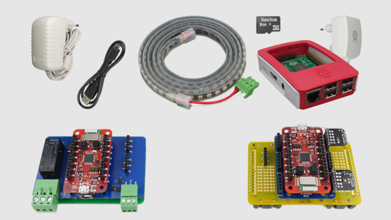

Co budeš ještě potřebovat:

* PC nebo notebook
* Ethernet kabel
* LAN router/switch s jedním volným portem
* Internetovou konektivitu


## Jak na to

1. *Sestav si Remote jednotku*

   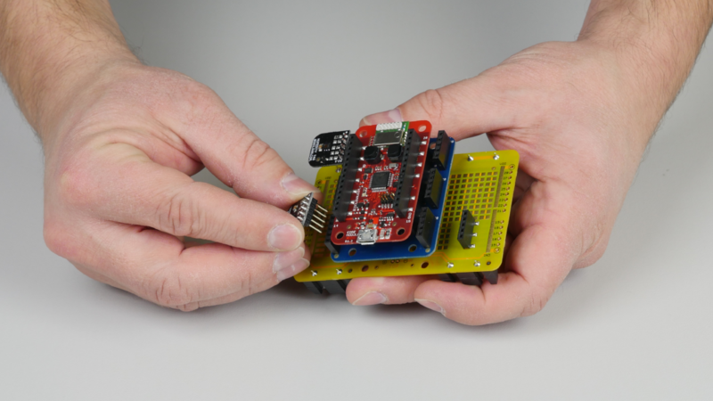

2. *Sestav si Base jednotku*

   

3. *Připoj LED pásek k Base jednotce*

   

4. *Připoj MicroUSB kabelem Base jednotku k Raspberry Pi*

   

5. *Připoj Ethernet kabel k Raspberry Pi*

   

6. *Připoj napájecí adaptér k Base jednotce*

   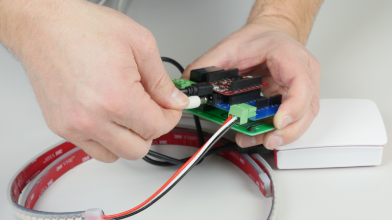

7. *Připoj napájecí adaptér k Raspberry Pi*

   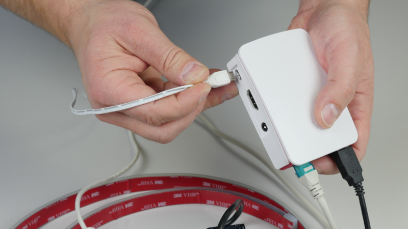

8. *Vlož baterky do Remote jednotky*

   

9. *Aktivuj párovací mód na Base jednotce*

   Zmáčkni a drž tlačítko BOOT na Core modulu Base jednotky dokud červená LED na Core Modulu nezačne blikat.
   BOOT tlačítko na Core modulu je označeno písmenem "B". 
   Párovací mód na Base jednotce je aktivní dokud nepřijme párovací signál z Remote jednotky.


10. *Vyšli párovací signál z remote jednotky*

    Zmáčkni a drž tlačítko BOOT na Core modulu Remote jednotky dokud červená LED nebude svítit 2 sekundy.
    BOOT tlačítko na Core modulu je označeno písmenem "B".
    Nyní došlo k odeslání párovacího signálu a LED na Base jednotce by měla přestat blikat.

    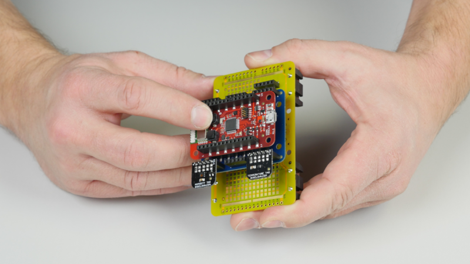

11. *Zapni světlo na LED pásku*

    Krátce zmáčkni BOOT tlačítko na Base jednotce nebo Remote jednotce a rozsviť LED pásek.
    Stejným tlačítkem můžeš pásek zhasnout.

    


## Hraní si s MQTT

Veškeré zprávy mezi Linux komponenty v systému jsou přenášeny přes MQTT broker.

Více informací o MQTT najdeš tady:

* [MQTT - Messaging via Broker](mqtt.md)

* [Mosquitto - MQTT Broker](mosquitto.md)

Jak můžeš komunikovat s MQTT brokerem:

1. Připoj se k Raspberry Pi přes SSH (port 22) použitím:

   * Windows: Použij [PuTTY](http://www.putty.org)

   * Linux + macOS: Použij ssh příkaz v Terminalu

2. Výchozí username je "pi" a heslo "raspberry"

3. Udělej si update své instalace:

   ```
   sudo apt-get update && sudo apt-get upgrade
   ```

4. Podívej se na naměřená data na Remote jednotce (posílají se každých 30 sekund):

   ```
   mosquitto_sub -v -t "nodes/remote/#"
   ```

   > Ctrl-C zastaví monitoring dat.

5. Použij LED pásek jako světlo a nastav si jeho intenzitu:

   ```
   mosquitto_pub -t "plugin/led-strip/data/set" -m '{"state": "color", "color": [0, 0, 0, 128]}'
   ```

6. Změň si trvale jas LED pásku:

   ```
   mosquitto_pub -t "plugin/led-strip/data/set" -m '{"brightness": 100}' -r
   ```

   > Poznámka *-r* uloží tvrale téma v MQTT brokeru

7. Použij LED pásek jako indikátor vlhkosti a teploty:

   ```
   mosquitto_pub -t "plugin/led-strip/data/set" -m '{"state": "rules"}'
   ```


### Sensory na Remote jednotce

* Naměřené hodnoty vlhkosti a teploty zasílané Remote jednotkou:

  ```
  nodes/remote/thermometer/i2c0-49 {"temperature": [23.62, "\u2103"]}
  nodes/remote/humidity-sensor/i2c0-40 {"relative-humidity": [33.2, "%"]}
  ```


### Relé na Base jednotce

* Relé má TRUE stav (zapnuto) nebo FALSE (vypnuto)

  ```
  mosquitto_pub -t 'nodes/base/relay/-' -m '{"state": true}'
  ```


#### Příklady

* Zapni relé:

  ```
  mosquitto_pub -t "nodes/base/relay/-/set" -m '{"state": true}'
  ```

* Vypni relé:

  ```
  mosquitto_pub -t "nodes/base/relay/-/set" -m '{"state": false}'
  ```

* Vyžádej si stav relé

  ```
  mosquitto_sub -v -t "nodes/base/relay/-" &
  mosquitto_pub -t "nodes/base/relay/-/get" -m '{}'
  ```


### LED pásek na Base jednotce

* Požadovaná barva na LED pásku připojeném k Base jednotce

  ```
  mosquitto_pub -t 'nodes/base/led-strip/-/set' -m  '{"pixels": "/wAAAP8AAAD/AAAA/wAAAP8AAAD/AAAA/wAAAP8AAAD/AAAA/wAAAP8AAAD/AAAA/wAAAP8AAAD/AAAA/wAAAP8AAAD/AAAA/wAAAP8AAAD/AAAA/wAAAP8AAAD/AAAA/wAAAP8AAAD/AAAA/wAAAP8AAAD/AAAA/wAAAP8AAAD/AAAA/wAAAP8AAAD/AAAA/wAAAP8AAAD/AAAA/wAAAP8AAAD/AAAA/wAAAP8AAAD/AAAA/wAAAP8AAAD/AAAA/wAAAP8AAAD/AAAA/wAAAP8AAAD/AAAA/wAAAP8AAAD/AAAA/wAAAP8AAAD/AAAA/wAAAP8AAAD/AAAA/wAAAP8AAAD/AAAA/wAAAP8AAAD/AAAA/wAAAP8AAAD/AAAA/wAAAP8AAAD/AAAA/wAAAP8AAAD/AAAA/wAAAP8AAAD/AAAA/wAAAP8AAAD/AAAA/wAAAP8AAAD/AAAA/wAAAP8AAAD/AAAA/wAAAP8AAAD/AAAA/wAAAP8AAAD/AAAA/wAAAP8AAAD/AAAA/wAAAP8AAAD/AAAA/wAAAP8AAAD/AAAA/wAAAP8AAAD/AAAA/wAAAP8AAAD/AAAA/wAAAP8AAAD/AAAA/wAAAP8AAAD/AAAA/wAAAP8AAAD/AAAA/wAAAP8AAAD/AAAA/wAAAP8AAAD/AAAA/wAAAP8AAAD/AAAA/wAAAP8AAAD/AAAA/wAAAP8AAAD/AAAA/wAAAP8AAAD/AAAA/wAAAP8AAAD/AAAA/wAAAP8AAAD/AAAA"}'
  ```

* Nastavení LED pásku (počet LEDek)

  ```
  mosquitto_pub -t 'nodes/base/led-strip/-/config/set' -m '{"mode": "rgb", "count": 150}'
  mosquitto_pub -t 'nodes/base/led-strip/-/config/set' -m '{"mode": "rgbw", "count": 144}'
  ```


### Skript "led-strip"

Limity teploty a vlhkosti jsou posuzovány Python skriptem běžícím v Linuxu na Raspberry Pi (používáme Raspbian).

Skript slouží jako komfortní driver pro LED pásek.

* Generuj data pro všechny pixely skrze atribut barvy:

  ```
  mosquitto_pub -t "plugin/led-strip/data/set" -m '{"color": [255,0,0,0]}'
  ```

* Použij data/set atributu barvy pro generování pixelů:

  ```
  mosquitto_pub -t "plugin/led-strip/data/set" -m '{"state": "color"}'
  ```

* Použij odpovídající pravidla ke generování pixelů:

  ```
  mosquitto_pub -t "plugin/led-strip/data/set" -m '{"state": "rules"}'
  ```

#### Příklady

* Použij LED pásek jako světlo

  ```
  mosquitto_pub -t "plugin/led-strip/data/set" -m '{"state": "color", "color": [0, 0, 0, 255], "brightness": 200}'
  ```

* Změň jas LED pásku

  ```
  mosquitto_pub -t "plugin/led-strip/data/set" -m '{"brightness": 100}'
  ```

* Vypni pásek

  ```
  mosquitto_pub -t "nodes/base/light/-/set" -m '{"state": false}'
  ```

* Zapni pásek

  ```
  mosquitto_pub -t "nodes/base/light/-/set" -m '{"state": true}'
  ```

> Pixely jsou uchovány

* Vyžádej si stav pásku

  ```
  mosquitto_sub -v -t "nodes/base/light/-" &
  mosquitto_pub -t "nodes/base/light/-/get" -m '{}'
  nodes/base/light/- {"state": true}
  ```


#### Změna výchozích limitů

Každému vyhovuje jiné prostředí a proto námi nastavené výchozí limity ti nemusejí vyhovovat.

* Změna pravidel (první pravidlo je použito k nastavení barvy):

  ```
  mosquitto_pub -t "plugin/led-strip/config" -m '{
    "rules": [
        {"relative-humidity": {"from": 60}, "color": [0, 255, 0, 0]},
        {"relative-humidity": {"to": 30}, "color": [255, 255, 0, 0]},
        {"temperature": {"from":30}, "color": [255, 0, 0, 0]},
        {"temperature": {"to": 22}, "color": [0, 0, 255, 0]},
        {"color": [0, 0, 0, 255]}
    ]
   }' -r
   ```

### Skript "blynk"

Aplikace Blynk.cc je perfektní nástroj pro ovládání tvé domácí automatizace z mobilu nebo tabletu.

1. Nainstaluj si Blynk na svůj chytrý telefon nebo tablet.

   > **Note** Použij Google Play nebo App Store.

2. Spusť Blynk a zvol **Create new project**. Pojmenuj ho (např. “Obývák”) a vyber **Generic Board** jako hardware.

   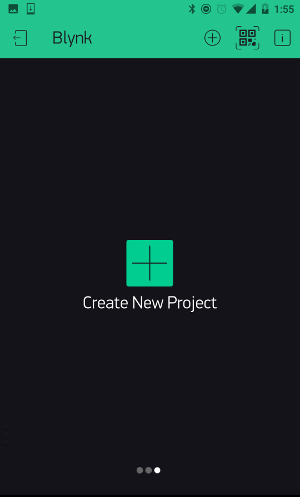
   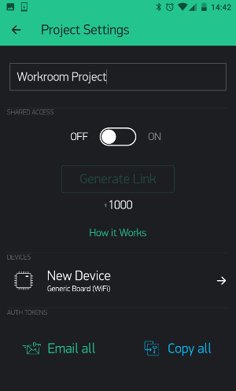

3. Zapiš si svůj Auth Token (nebo si ho nech aplikací poslat na mail).

* Nastavení Blynk Auth tokenu přes MQTT.

  ```
  mosquitto_pub -t "plugin/blynk/config" -m '{"token":"your_token"}' -r
  ```
4. Vytvoř si widgety Value pro senzory zobrazování hodnot teploty a vlhkosti

   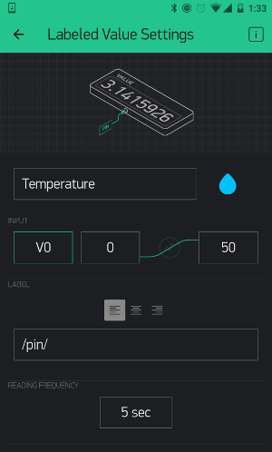
   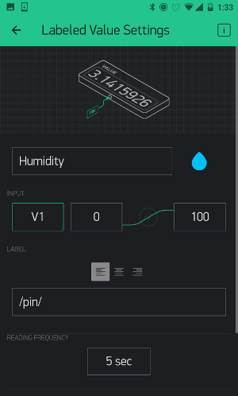

5. Vytvoř si widgety pro History Graph naměřených dat a Slider pro ovládání jasu

   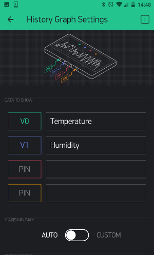
   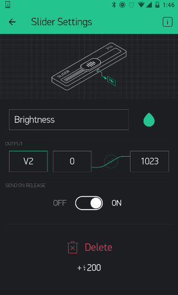

6. vytvoř si widgety Tlačítko pro ovládání LED pásku a relé

   
   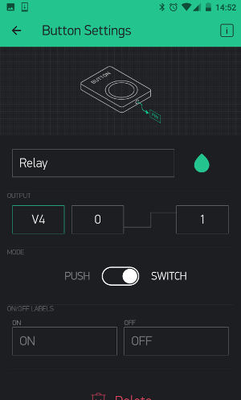

7. Vytvoř si widget zeRGBa pro změny barev LED pásku

   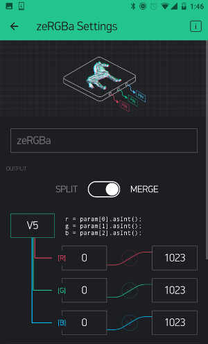

8. Nyní máš funkční Blynk dashboard.

   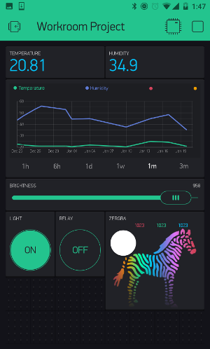


## Přiřazení virtuálních pinů pro Blynk

| Virtual PIN  | Topic                                | Payload key       | Unit  |
| ------------ | ------------------------------------ | ----------------- | ----- |
| 0            | nodes/remote/thermometer/+           | temperature       | °C    |
| 1            | nodes/remote/humidity-sensor/+       | relative-humidity | %     |
| 2            | plugin/led-strip/data/set/ok         | brightness        |       |
| 2            | plugin/led-strip/data                | brightness        |       |
| 3            | nodes/base/light/-                   | state             |       |
| 4            | nodes/base/relay/-                   | state             |       |
| 5            | plugin/led-strip/data/set/ok         | color             |       |
| 5            | plugin/led-strip/data                | color             |       |
